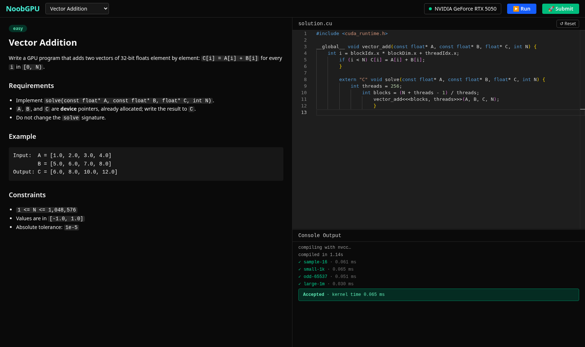
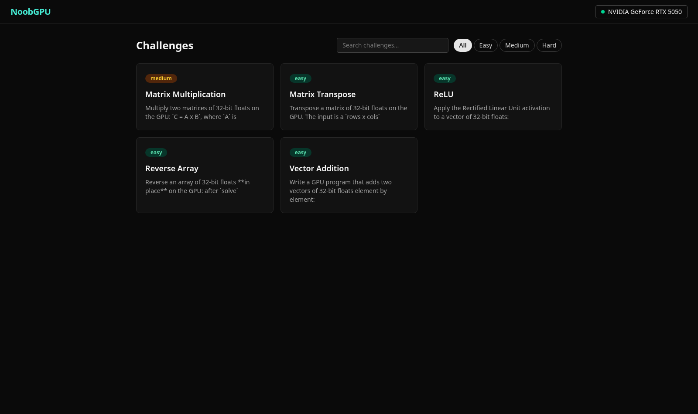

# NoobGPU

**A local-first CUDA challenge playground.** Solve LeetCode-style GPU programming
challenges in your browser, with every submission compiled by `nvcc` and executed on
**your own NVIDIA GPU** — kernel times are ground truth, measured on real silicon with
CUDA events.



## What you get

- **Challenge workspace** — problem statement, Monaco editor with a CUDA starter
  template, and a console that streams compiler output and per-test results live.
- **Run vs Submit** — Run checks the sample tests; Submit judges the full suite and
  records the verdict (Accepted, Wrong Answer, Compile Error, Runtime Error, Time
  Limit Exceeded) with the measured kernel time.
- **Submissions history** — every submission is stored locally in SQLite; view old
  code and restore it to the editor.
- **Honest timing** — the judge times only your `solve()` call via CUDA events;
  host-side copies are excluded.
- Your code never leaves your machine.



## Requirements

- Linux (Windows works via WSL2)
- An NVIDIA GPU with a recent driver (`nvidia-smi` should work)
- CUDA toolkit (`nvcc` on PATH)
- [uv](https://docs.astral.sh/uv/) and [Node.js](https://nodejs.org) (to build)

## Quickstart

```bash
git clone https://github.com/syaffers/noobgpu.git
cd noobgpu
make build                    # builds the frontend + a wheel with everything bundled
uv tool install ./server/dist/noobgpu-0.1.0-py3-none-any.whl
noobgpu                       # starts the server — open the printed URL in your browser
```

`noobgpu` serves everything from one process — UI, API, judge — and works from any
directory. Flags: `--port`, `--host`.

## Development

```bash
make dev     # backend :8000 + frontend :5173 with hot reload
make test    # server test suite (GPU tests auto-skip without a GPU)
make lint    # ruff + oxlint
```

The repo layout: `server/` (FastAPI + judge), `web/` (React + Monaco), `challenges/`
(challenge packs — data, not code). See [ROADMAP.md](ROADMAP.md) for where the project
is headed and [CONTRIBUTING.md](CONTRIBUTING.md) for how to add a challenge.

## How judging works

Each challenge pack ships a `harness.cu` that owns `main()` and a `reference.cu` known-
good solution. Your submission only provides `solve()` — it's compiled together with
the harness, run against deterministic generated inputs, and compared to the
reference's output within a per-challenge tolerance. Expected outputs are cached
content-addressed, so editing a pack invalidates them automatically. Details in
[challenges/README.md](challenges/README.md).

## License

Code is [MIT](LICENSE). Challenge content (`challenges/`) is
[CC BY 4.0](challenges/LICENSE) — reuse it, with attribution.

NoobGPU is an independent open-source project inspired by
[LeetGPU](https://leetgpu.com); it shares no code or challenge content with it.
